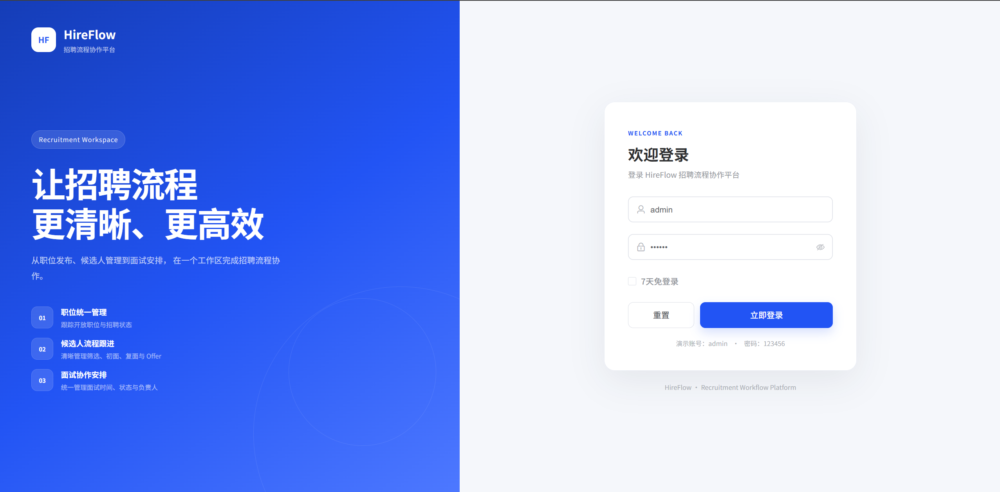
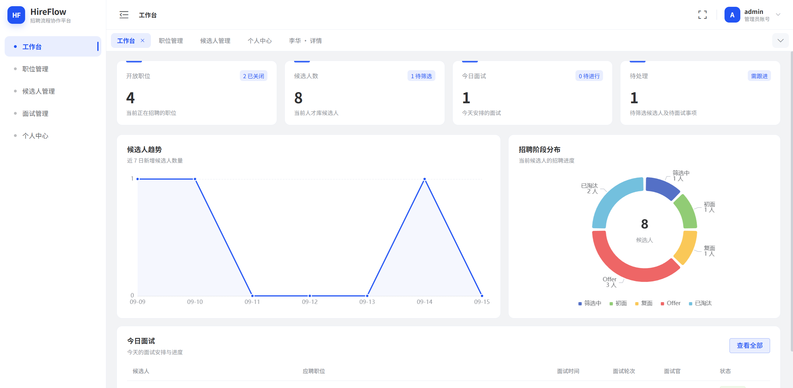
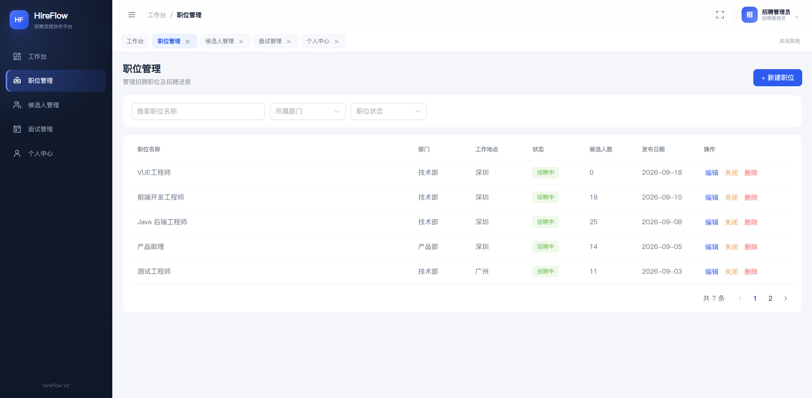
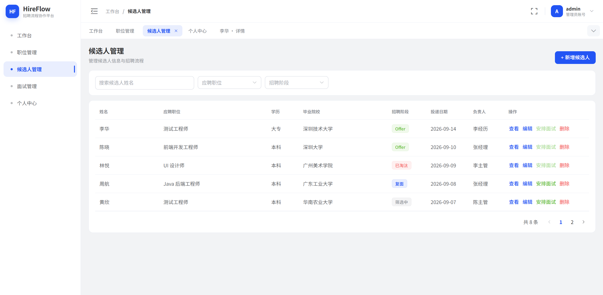
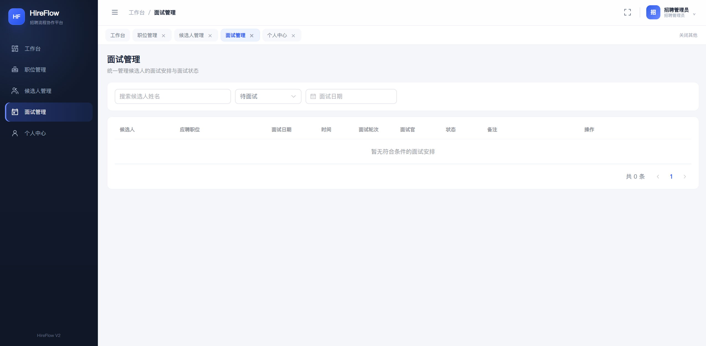
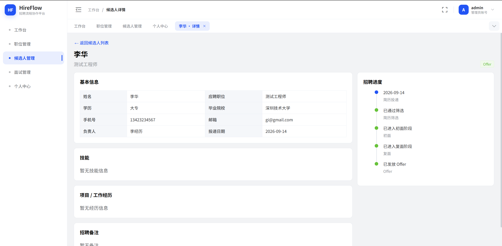

# HireFlow 招聘流程协作平台

> 一个围绕职位、候选人、面试与招聘阶段流转构建的前后端分离招聘协作系统。

HireFlow 使用 **Vue 3 + TypeScript** 构建前端，使用 **Node.js + Express** 提供 RESTful API，并通过 **JWT + SQLite** 完成登录鉴权与业务数据持久化。项目覆盖职位管理、候选人管理、面试安排、招聘阶段流转、个人资料与密码修改等完整招聘后台业务流程。

## 在线体验

- **Frontend Demo**：https://hireflow-wed.onrender.com
- **Backend API**：https://hireflow-api-blsl.onrender.com
- **API Health Check**：https://hireflow-api-blsl.onrender.com/api/health
- **GitHub**：https://github.com/gielensras471-creator/hireflow

### 演示账号

```text
账号：admin
密码：123456
```

> Render 免费实例长时间无访问时可能进入休眠，首次打开 Demo 或登录时可能需要等待服务唤醒。

---

## 作品展示

### 1. 登录与身份认证



- 独立登录页与品牌化视觉设计
- Express 后端校验账号密码
- bcrypt 密码哈希验证
- 登录成功后签发 JWT
- Axios 自动携带 Bearer Token
- Token 失效后自动清理会话并返回登录页

### 2. Dashboard 招聘数据概览



- 招聘核心指标概览
- ECharts 数据可视化
- 职位、候选人、面试数据统一展示
- 支持 Loading / Empty / Error / Retry 状态

### 3. 职位管理



- 职位新增、编辑、删除
- 开启 / 关闭招聘状态
- 搜索、筛选与分页
- 数据通过 Express API 写入 SQLite

### 4. 候选人管理



- 候选人新增、编辑、删除
- 搜索、筛选、分页
- 候选人详情页
- 招聘阶段状态管理
- 多标签页与动态候选人详情 Tab

### 5. 面试管理



- 安排、编辑、完成、取消和删除面试
- 维护候选人、面试官、时间与面试类型
- 与候选人招聘阶段联动

### 6. 候选人详情 / 招聘流程



招聘阶段：

```text
筛选
  ↓
初面
  ↓
复面
  ↓
Offer / 淘汰
```

---

## 项目亮点

### 前后端分离

```text
Vue 3 / TypeScript
        ↓
Pinia / API Module
        ↓
Axios + Bearer Token
        ↓
Node.js / Express
        ↓
JWT Middleware
        ↓
RESTful API
        ↓
SQLite
```

项目从早期 Mock API 版本升级为真实前后端架构，职位、候选人、面试、用户资料和账号密码均通过 HTTP API 与数据库完成读写。

### JWT 登录鉴权

- 普通登录有效期：12 小时
- “7 天内保持登录”：7 天
- Axios 请求拦截器自动附加 `Authorization: Bearer <token>`
- Express 认证中间件统一校验受保护接口
- Token 失效后前端自动清理本地登录状态

### SQLite 数据持久化

数据库默认生成在：

```text
server/data/hireflow.db
```

首次运行时自动建表并写入演示数据：

```text
users
positions
candidates
interviews
```

本地数据库文件已加入 `.gitignore`，不会提交到 GitHub。

### 用户资料与密码管理

- 用户资料通过 API 持久化
- 修改密码前验证当前密码
- 新密码使用 bcrypt 哈希后保存
- 修改后重新登录即可验证新密码

---

## 技术栈

### Frontend

| 技术         | 用途                  |
| ------------ | --------------------- |
| Vue 3        | 核心前端框架          |
| TypeScript   | 类型约束与工程维护    |
| Pinia        | 全局状态管理          |
| Vue Router   | 页面路由与路由鉴权    |
| Axios        | HTTP 请求、Token 拦截 |
| Element Plus | 后台 UI 组件          |
| ECharts      | 招聘数据可视化        |
| Vite         | 开发服务器与生产构建  |
| Sass         | 样式组织              |

### Backend

| 技术          | 用途                        |
| ------------- | --------------------------- |
| Node.js       | 服务端运行时                |
| Express       | RESTful API                 |
| SQLite        | 关系型数据持久化            |
| `node:sqlite` | Node.js 24 内置 SQLite 接口 |
| jsonwebtoken  | JWT 签发与校验              |
| bcryptjs      | 密码哈希与验证              |
| cors          | 跨域访问控制                |
| dotenv        | 环境变量管理                |

---

## 核心业务功能

- Dashboard 招聘数据概览
- 职位新增 / 编辑 / 删除 / 开启关闭
- 候选人新增 / 编辑 / 删除 / 搜索 / 筛选 / 分页
- 候选人详情与动态 Tab
- 招聘阶段：筛选 → 初面 → 复面 → Offer / 淘汰
- 面试安排 / 编辑 / 完成 / 取消 / 删除
- JWT 登录与受保护路由
- 用户资料持久化
- 密码修改
- Loading / Empty / Error / Retry 状态
- 响应式适配

---

## RESTful API

### Auth

```text
POST   /api/auth/login
GET    /api/auth/me
```

### Profile

```text
GET    /api/profile
PATCH  /api/profile
PATCH  /api/profile/password
```

### Positions

```text
GET    /api/positions
POST   /api/positions
PATCH  /api/positions/:id
DELETE /api/positions/:id
```

### Candidates

```text
GET    /api/candidates
GET    /api/candidates/:id
POST   /api/candidates
PATCH  /api/candidates/:id
DELETE /api/candidates/:id
```

### Interviews

```text
GET    /api/interviews
GET    /api/interviews/:id
POST   /api/interviews
PATCH  /api/interviews/:id
DELETE /api/interviews/:id
```

---

## 项目结构

```text
hireflow/
├─ server/
│  ├─ db/
│  │  └─ database.js
│  ├─ middleware/
│  │  ├─ auth.js
│  │  └─ error.js
│  ├─ routes/
│  │  ├─ auth.js
│  │  ├─ candidates.js
│  │  ├─ interviews.js
│  │  ├─ positions.js
│  │  └─ profile.js
│  ├─ seed/
│  │  └─ seed-data.json
│  ├─ scripts/
│  │  └─ reset-db.js
│  ├─ data/
│  ├─ .env.example
│  └─ index.js
│
├─ src/
│  ├─ api/
│  ├─ layouts/
│  ├─ router/
│  ├─ stores/
│  ├─ styles/
│  ├─ types/
│  ├─ utils/
│  └─ views/
│
├─ docs/
│  └─ images/
│     ├─ login.png
│     ├─ dashboard.png
│     ├─ positions.png
│     ├─ candidates.png
│     ├─ interviews.png
│     └─ candidate-detail.png
│
├─ public/
├─ .env.production
├─ package.json
└─ vite.config.ts
```

---

## 本地运行

> 当前版本使用 Node.js 内置 `node:sqlite`，建议使用 **Node.js 24.15+**。

### 1. 安装依赖

```bash
pnpm install
```

### 2. 启动 Express API

打开第一个终端：

```bash
pnpm api
```

默认地址：

```text
http://localhost:3300
```

健康检查：

```text
http://localhost:3300/api/health
```

开发模式：

```bash
pnpm api:dev
```

### 3. 启动 Vue 前端

打开第二个终端：

```bash
pnpm dev
```

默认地址：

```text
http://localhost:5173
```

开发环境下 `/api` 由 Vite 代理到本地 Express 服务。

### 4. 生产构建

```bash
pnpm build
```

### 5. 重置数据库

```bash
pnpm db:reset
pnpm api
```

重置后演示账号恢复为：

```text
admin / 123456
```

---

## 环境变量

### 本地后端

复制：

```text
server/.env.example
```

为：

```text
server/.env
```

示例：

```env
PORT=3300
CLIENT_ORIGIN=http://localhost:5173
JWT_SECRET=replace-with-a-long-random-secret-before-production
```

生产环境必须使用随机且足够长的 `JWT_SECRET`，不要将真实密钥提交到 GitHub。

### 生产前端

`.env.production`：

```env
VITE_HIREFLOW_API_URL=https://hireflow-api-blsl.onrender.com/api
```

---

## 部署

项目采用前后端独立部署：

```text
Frontend
https://hireflow-wed.onrender.com
        ↓
Backend API
https://hireflow-api-blsl.onrender.com/api
        ↓
Express
        ↓
JWT
        ↓
SQLite
```

前端与后端均部署在 Render。

> 当前演示环境使用 SQLite。Render 免费实例的文件系统不适合作为长期生产数据库，因此该部署主要用于作品演示和技术验证。

---

## 版本说明

### V2.1

- 将 Mock API 替换为 Node.js + Express 后端
- 接入 SQLite 数据持久化
- 增加 JWT 登录认证
- 增加 bcrypt 密码哈希
- 完成职位 / 候选人 / 面试 RESTful CRUD
- 用户资料与密码修改接入真实 API
- 完成前后端独立部署与线上联调

### V2.0

- 重构后台 Layout、Sidebar、Header、Tabs 与 Router
- 清理模板示例页面与残留功能
- 重新整理 Pinia、API Module 与全局样式
- 保留并强化招聘业务流程

---

## 后续可扩展方向

- API 参数校验与统一错误码
- 单元测试 / E2E 测试
- OpenAPI / Swagger 文档
- 前端路由与组件分包
- MySQL / PostgreSQL 数据库迁移
- RBAC 角色权限模型
- 操作日志
- 简历上传与解析
